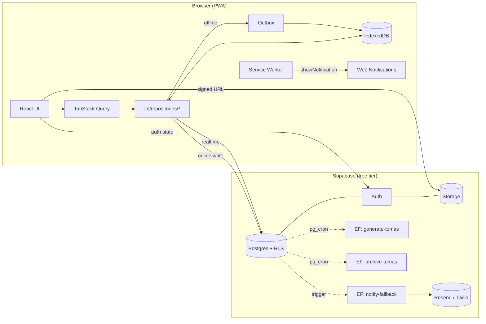
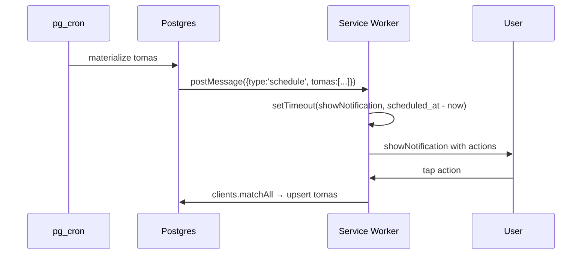
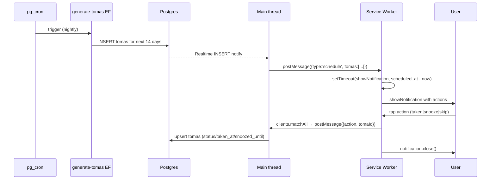
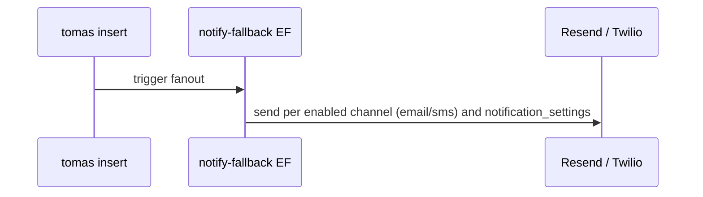

# Design: Medication Tracker PWA

> Outcome: a single, reviewable technical plan for a greenfield React + Vite + TypeScript PWA backed by Supabase, delivering offline-friendly medication tracking, reminders, and shared family access. This document is the contract that `sdd-tasks` and `sdd-apply` will follow.

## Quick path

1. **Read sections 1–4 first** — they describe the runtime shape (browser ↔ SW ↔ Supabase, offline outbox).
2. **Section 5 is the SQL migration** — paste-ready against an empty Supabase project.
3. **Section 14 is the apply order** — the steps `sdd-apply` will follow.
4. **Sections 6, 8, 9, 12 are the contracts** — RLS, notifications, toma lifecycle, module APIs.

---

## 1. System Overview

A client-only PWA. The browser holds the app shell in cache, talks directly to Supabase via the JS client (PostgREST + Realtime), and uses a Service Worker for notifications and a Web Push–free path. A thin `lib/` layer wraps Supabase and IndexedDB so the UI never decides "online vs offline" — it always calls the repository, which picks the right path. Scheduled work (materialize tomas, archive old tomas, send email/SMS fallbacks) runs in Supabase Edge Functions on cron.



| Layer | Lives in | Responsibility |
|-------|----------|----------------|
| App shell + routes | React + React Router v6 | Lazy-loaded pages |
| Server state | TanStack Query | Cache, retries, mutations |
| UI state | Zustand | Active paciente, theme, modal flags |
| Data access | `src/lib/` | Repository pattern: Supabase + IndexedDB + outbox |
| Offline cache + outbox | IndexedDB (`idb`) | Outbox queue, read-through cache for today's tomas |
| Reminders | SW (in-app) + Edge Function (email/SMS) | showNotification + DB trigger fanout |
| Background jobs | Supabase Edge Functions (Deno) + `pg_cron` | Generate tomas, archive, dedupe |

---

## 2. Frontend Architecture

### Folder structure

```
medicamentos/
├── index.html
├── package.json
├── pnpm-lock.yaml
├── tsconfig.json
├── vite.config.ts
├── .env.example                  # VITE_SUPABASE_URL, VITE_SUPABASE_ANON_KEY
├── public/
│   ├── icons/                    # PWA icons (192, 512, maskable)
│   └── offline.html              # offline fallback page
├── src/
│   ├── main.tsx
│   ├── App.tsx
│   ├── router.tsx
│   ├── components/               # shared UI (Button, Card, Modal, Toast)
│   ├── features/                 # one folder per domain: auth, family, pacientes, medications,
│   │                             # plans, schedules, intake, reminders, adherence, interactions,
│   │                             # stock, vacation, retention, reports, settings
│   ├── lib/                      # supabase.ts, idb.ts, repositories/, outbox/, time/, validation/, sw/, pdf/
│   ├── workers/                  # web workers (PDF generation)
│   └── styles/
└── tests/                        # unit/, integration/, e2e/ (vitest + playwright)
```

### Library choices (locked by proposal; rationale recorded for sdd-verify)

| Concern | Library | Rationale |
|---------|---------|-----------|
| Server state | **TanStack Query v5** | `networkMode: 'offlineFirst'` for outbox; auto-invalidation on patient switch. |
| UI state | **Zustand** | <1 KB, no Provider; perfect for active paciente, modal flags, theme. |
| Routing | **React Router v6+** with `lazy()` per route | Mature, supports nested routes for cuidador/paciente sub-views. |
| Forms | **react-hook-form + Zod** | Schema-first; Zod schemas reused in `lib/validation/` and exported to Edge Functions. |
| Date/time | **date-fns + date-fns-tz** | `formatInTimeZone` is exactly what TZ-aware tomas need. |
| UI | **shadcn/ui + Tailwind** (starting point; swappable) | Owned components, no version lock-in. Any swap keeps the `components/` API. |
| PDF | **@react-pdf/renderer** in a Web Worker | Deterministic, off the main thread. |

### State boundaries

| State | Where | Why |
|-------|-------|-----|
| Active paciente ID | Zustand `useActivePaciente` | Header shared; persisted in localStorage. |
| Server cache (tomas, medications, …) | TanStack Query | Invalidated on `auth_state_change` and patient switch. |
| Form state | react-hook-form | Per-page, never global. |
| Outbox queue | IndexedDB | Survives reload; only `lib/` knows. |

---

## 3. PWA / Service Worker

### `vite-plugin-pwa` config (outline)

```ts
// vite.config.ts (sketch; sdd-apply will produce the real file)
import { VitePWA } from 'vite-plugin-pwa';

VitePWA({
  registerType: 'autoUpdate',
  injectRegister: 'auto',
  manifest: { name: 'Medicamentos', short_name: 'Meds', display: 'standalone', start_url: '/', /* theme, icons, maskable */ },
  workbox: {
    navigateFallback: '/offline.html',
    runtimeCaching: [
      { urlPattern: /^https:\/\/[^/]+\.supabase\.co\/rest\/v1\/(tomas|medications|schedules|pacientes|family_members|vacations|notification_settings)/,
        handler: 'StaleWhileRevalidate', options: { cacheName: 'supabase-rest', expiration: { maxEntries: 200, maxAgeSeconds: 86400 } } },
      { urlPattern: /\.(?:js|css|woff2)$/, handler: 'CacheFirst', options: { cacheName: 'assets' } },
    ],
  },
})
```

### Routes that MUST work offline (app shell)

| Route | Offline behavior |
|-------|------------------|
| `/`, `/intake/today`, `/pacientes`, `/medications`, `/schedules`, `/admin/interactions` | Read from cache; writes queued via outbox. Banner "Sin conexión" on `/`. |
| `/login` | Cached static page; auth not possible offline. |
| `/reports/export` | Disabled with toast "Necesita conexión para generar el PDF." |

### Reminder delivery (in-app, from Service Worker)



| Channel | Where it runs | Trigger |
|---------|---------------|---------|
| `in_app` | Service Worker (`showNotification` + `showTrigger` where supported) | Per-toma `setTimeout`/`showTrigger` scheduled when the toma row appears. |
| `email` | Supabase Edge Function `notify-fallback` | DB trigger on `tomas` insert fans out to Edge Function; reads `notification_settings` and Resend API. |
| `sms` | Same Edge Function, Twilio adapter | Same trigger. |

### iOS PWA limitation (documented, not solved)

Web Notifications on iOS Safari/PWA are unreliable in the background. The design **assumes** this and treats `in_app` as a "dashboard banner" not a system notification, with an explicit "notification status" indicator (green / yellow / red) per spec/reminder. The Service Worker still attempts `showNotification` opportunistically.

### Periodic Background Sync (future)

Not used in v1. Documented for v2: register a `periodicSync` event to reconcile missed tomas when the device was offline for hours. iOS PWA does not support it; the Edge Function cron path is the safety net.

---

## 4. Offline Strategy (Outbox Pattern)

### IndexedDB schema (via `idb` v8+)

```ts
// src/lib/idb.ts (sketch)
const db = await openDB('meds', 1, { upgrade(db) {
  db.createObjectStore('outbox', { keyPath: 'id', autoIncrement: true });
  db.createObjectStore('cached_pacientes', { keyPath: 'id' });
  db.createObjectStore('cached_medications', { keyPath: 'id' });
  db.createObjectStore('cached_today_tomas', { keyPath: 'id' });
}});
```

| Store | Purpose | Eviction |
|-------|---------|----------|
| `outbox` | Pending writes; value = `{ op, table, payload, createdAt, attempts }` | Drained on `online` event. |
| `cached_pacientes` | Active paciente list (read-through) | On logout / patient switch. |
| `cached_medications` | Active medications per paciente | On `medications` mutation. |
| `cached_today_tomas` | Today's tomas (04:00 → +24 h local) | Cron tick at 04:00 local. |

### Write path

```mermaid
flowchart TD
  A[UI calls repository.insert toma] --> B{navigator.onLine?}
  B -- yes --> C[supabase.from('tomas').upsert]
  C -- success --> D[Query invalidates tomas]
  C -- network error --> E[enqueue in outbox]
  B -- no --> E
  E --> F[write outbox + optimistic update]
  F -.-> H[window 'online' event] --> I[outbox.replay] --> C
  C -- success --> J[delete from outbox]
  C -- still failing --> K[backoff max 5 attempts]
```

### Conflict policy (v1)

**Last-write-wins**, server-authoritative. `updated_at` on every mutable row lets the server reject stale updates via `WHERE updated_at = $expected`. Limitation: two devices editing the same row offline see one write silently win on reconnect. v1 mitigates this by keeping `tomas` as the only high-frequency device writer; meds and schedules are single-cuidador. v2: add `tomas.revision` and surface "conflicto detectado".

### Read-through cache for tomas

`lib/repositories/tomas.ts.listToday(pid)` returns cached rows immediately, refreshes from Supabase in the background when online (reconcile by `id`), and falls back to cache as-is offline (UI shows "Sin conexión" badge).

---

## 5. Supabase Schema — Consolidated Migration

This is the single migration `sdd-apply` will run against the new empty Supabase project. It is the spec at the SQL level.

```sql
-- medications PWA v1 — run against an empty Supabase Postgres DB.
-- Source of truth: openspec/changes/medication-tracker-pwa/specs/schema/spec.md
create extension if not exists "pgcrypto";
create extension if not exists "btree_gist";   -- for tstzrange exclusion on vacations

-- 5.1 RLS helpers (SECURITY DEFINER breaks family_members self-reference recursion)
create or replace function public.is_active_family_member(p_paciente uuid)
  returns boolean language sql security definer stable set search_path = public as $$
  select exists (select 1 from family_members where paciente_id = p_paciente and user_id = auth.uid() and status = 'active');
$$;
create or replace function public.is_cuidador_principal(p_paciente uuid)
  returns boolean language sql security definer stable set search_path = public as $$
  select exists (select 1 from family_members where paciente_id = p_paciente and user_id = auth.uid()
                   and role = 'cuidador_principal' and status = 'active');
$$;
create or replace function public.paciente_of_medication(p_medication uuid)
  returns uuid language sql security definer stable set search_path = public as $$
  select paciente_id from medications where id = p_medication limit 1;
$$;

-- 5.2 Enums
create type intake_status           as enum ('pending','taken_on_time','taken_late','skipped','missed');
create type interaction_severity    as enum ('info','caution','warning','severe');
create type family_role             as enum ('owner_paciente','cuidador_principal','cuidador_secundario','medico');
create type family_membership_state as enum ('pending','active','revoked');
create type notification_channel    as enum ('in_app','email','sms');

-- 5.3 Tables
create table pacientes (
  id uuid primary key default gen_random_uuid(),
  cuidador_id uuid not null references auth.users(id),
  name text not null, dob date, photo_url text,
  timezone_id text not null default 'America/Buenos_Aires',
  created_at timestamptz not null default now());
create index pacientes_cuidador_idx on pacientes(cuidador_id);

create table family_members (
  id uuid primary key default gen_random_uuid(),
  paciente_id uuid not null references pacientes(id) on delete cascade,
  user_id uuid not null references auth.users(id) on delete cascade,
  role family_role not null, status family_membership_state not null default 'pending',
  created_at timestamptz not null default now());
create unique index family_members_unique_active
  on family_members(paciente_id, user_id) where status = 'active';
create index family_members_user_status_idx on family_members(user_id, status);

create table temporadas (
  id uuid primary key default gen_random_uuid(),
  paciente_id uuid not null references pacientes(id) on delete cascade,
  name text not null, start_date date not null, end_date date not null,
  closed_at timestamptz, created_at timestamptz not null default now(),
  constraint temporadas_end_after_start check (end_date >= start_date));
create unique index temporadas_one_open_per_paciente
  on temporadas(paciente_id) where closed_at is null;

create table plans (
  id uuid primary key default gen_random_uuid(),
  paciente_id uuid not null references pacientes(id) on delete cascade,
  temporada_id uuid references temporadas(id) on delete set null,
  is_permanent boolean not null default false, notes text,
  created_at timestamptz not null default now(),
  constraint plans_permanent_no_temporada check (
    (is_permanent = true  and temporada_id is null) or (is_permanent = false)));
create index plans_paciente_idx  on plans(paciente_id);
create index plans_temporada_idx on plans(temporada_id);

create table medications (
  id uuid primary key default gen_random_uuid(),
  paciente_id uuid not null references pacientes(id) on delete cascade,
  name text not null,
  dose_value numeric not null check (dose_value > 0),
  dose_unit text not null, dose_unit_other text,   -- dose_unit from seed list or 'other'
  route text not null, frequency_hint text, notes text, photo_url text,
  stock_estimate integer not null default 0 check (stock_estimate >= 0),
  low_stock_threshold integer not null default 7 check (low_stock_threshold >= 0),
  active boolean not null default true,
  created_at timestamptz not null default now(),
  updated_at timestamptz not null default now(),
  constraint medications_unit_other check (
    (dose_unit = 'other' and dose_unit_other is not null) or (dose_unit <> 'other')));
create index medications_paciente_idx        on medications(paciente_id);
create index medications_paciente_active_idx on medications(paciente_id) where active;

create table schedules (
  id uuid primary key default gen_random_uuid(),
  medication_id uuid not null references medications(id) on delete cascade,
  time_of_day time not null,
  weekday_mask integer not null check (weekday_mask between 0 and 127),
  timezone_id text not null default 'America/Buenos_Aires',
  active boolean not null default true, notes text,
  created_at timestamptz not null default now(),
  updated_at timestamptz not null default now());
create index schedules_medication_active_idx on schedules(medication_id) where active;

create table tomas (
  id uuid primary key default gen_random_uuid(),
  schedule_id uuid not null references schedules(id) on delete cascade,
  paciente_id uuid not null references pacientes(id) on delete cascade,
  scheduled_at timestamptz not null,
  status intake_status not null default 'pending',
  taken_at timestamptz, snoozed_until timestamptz, skip_reason text,
  registered_by uuid not null references auth.users(id), notes text,
  created_at timestamptz not null default now(),
  updated_at timestamptz not null default now(),
  constraint tomas_unique_slot unique (schedule_id, scheduled_at));
create index tomas_paciente_scheduled_idx on tomas(paciente_id, scheduled_at desc);
create index tomas_paciente_status_idx    on tomas(paciente_id, status);

create table tomas_archive (   -- mirrors tomas + archived_at
  id uuid primary key,
  schedule_id uuid not null references schedules(id) on delete cascade,
  paciente_id uuid not null references pacientes(id) on delete cascade,
  scheduled_at timestamptz not null, status text not null,
  taken_at timestamptz, snoozed_until timestamptz, skip_reason text,
  registered_by uuid not null references auth.users(id), notes text,
  created_at timestamptz not null, updated_at timestamptz not null,
  archived_at timestamptz not null default now());
create index tomas_archive_paciente_scheduled_idx on tomas_archive(paciente_id, scheduled_at);
create index tomas_archive_archived_idx            on tomas_archive(archived_at);

-- BINDING DECISION #1: vacation overlap via partial EXCLUDE (tstzrange '[)' = shared boundary NOT overlapping).
create table vacations (
  id uuid primary key default gen_random_uuid(),
  paciente_id uuid not null references pacientes(id) on delete cascade,
  medication_id uuid references medications(id) on delete cascade,   -- NULL = GLOBAL
  starts_at timestamptz not null, ends_at timestamptz not null, reason text,
  created_by uuid not null references auth.users(id),
  created_at timestamptz not null default now(),
  constraint vacations_end_after_start check (ends_at > starts_at),
  constraint vacations_no_overlap_global
    exclude using gist (paciente_id   with =, tstzrange(starts_at, ends_at, '[)') with &&) where (medication_id is null),
  constraint vacations_no_overlap_per_medication
    exclude using gist (medication_id with =, tstzrange(starts_at, ends_at, '[)') with &&) where (medication_id is not null));
create index vacations_paciente_range_idx on vacations(paciente_id, starts_at, ends_at);

create table retention_policies (
  id uuid primary key default gen_random_uuid(),
  paciente_id uuid references pacientes(id) on delete cascade,   -- NULL = global default
  retention_days integer not null default 730 check (retention_days > 0),
  created_by uuid not null references auth.users(id),
  created_at timestamptz not null default now(),
  updated_at timestamptz not null default now());
create unique index retention_policies_unique_paciente
  on retention_policies(paciente_id) where paciente_id is not null;
insert into retention_policies (paciente_id, retention_days, created_by)
  select null, 730, id from auth.users order by created_at limit 1;   -- no-op until first signup

-- BINDING DECISION #3: notification_settings is a separate table (per-channel + per-medication override).
create table notification_settings (
  id uuid primary key default gen_random_uuid(),
  paciente_id uuid not null references pacientes(id) on delete cascade,
  medication_id uuid references medications(id) on delete cascade,   -- NULL = paciente-wide
  channel notification_channel not null, enabled boolean not null default true,
  created_at timestamptz not null default now(),
  updated_at timestamptz not null default now(),
  constraint notification_settings_unique unique (paciente_id, medication_id, channel));
create index notification_settings_lookup_idx on notification_settings(paciente_id, medication_id);

create table interactions (
  id uuid primary key default gen_random_uuid(),
  drug_a text not null, drug_b text not null,
  severity interaction_severity not null, description text not null, source_notes text,
  created_at timestamptz not null default now(),
  constraint interactions_canonical_order check (drug_a < drug_b),
  constraint interactions_unique_pair unique (drug_a, drug_b));

create table stock_adjustments (
  id uuid primary key default gen_random_uuid(),
  medication_id uuid not null references medications(id) on delete cascade,
  previous_estimate integer not null, new_estimate integer not null,
  reason text not null, adjusted_by uuid not null references auth.users(id),
  created_at timestamptz not null default now());
create index stock_adjustments_medication_idx on stock_adjustments(medication_id);

-- BINDING DECISION #2: adherence_daily is OPTIONAL in v1 (table created empty; rollup function NOT deployed).
create table adherence_daily (
  id uuid primary key default gen_random_uuid(),
  paciente_id uuid not null references pacientes(id) on delete cascade,
  date date not null,
  taken_on_time integer not null default 0,
  taken_late    integer not null default 0,
  missed        integer not null default 0,
  skipped       integer not null default 0,
  rollup_computed_at timestamptz not null default now(),
  constraint adherence_daily_unique unique (paciente_id, date));
-- v2 rollup (DO NOT DEPLOY in v1):
-- create or replace function public.compute_adherence_daily(p_date date) returns void
--   language plpgsql security definer set search_path = public as $$ begin
--     insert into adherence_daily (paciente_id, date, taken_on_time, taken_late, missed, skipped)
--     select paciente_id, p_date,
--       count(*) filter (where status = 'taken_on_time'),
--       count(*) filter (where status = 'taken_late'),
--       count(*) filter (where status = 'missed'),
--       count(*) filter (where status = 'skipped' and coalesce(skip_reason,'') <> 'vacation')
--     from tomas where scheduled_at::date = p_date
--     group by paciente_id
--     on conflict (paciente_id, date) do update set
--       taken_on_time = excluded.taken_on_time, taken_late = excluded.taken_late,
--       missed = excluded.missed, skipped = excluded.skipped, rollup_computed_at = now();
-- end; $$;

-- 5.4 Triggers (a) closed-temporada immutability (b) stock decrement (c) stock audit
create or replace function public.prevent_closed_temporada_mutation() returns trigger language plpgsql as $$
declare v_tid uuid; begin
  v_tid := coalesce(NEW.temporada_id, OLD.temporada_id);
  if v_tid is null then return coalesce(NEW, OLD); end if;
  if exists (select 1 from temporadas where id = v_tid and closed_at is not null) then
    raise exception 'Temporada % is closed; rows are immutable', v_tid; end if;
  return coalesce(NEW, OLD);
end; $$;
create trigger plans_immutability before update or delete on plans
  for each row execute function public.prevent_closed_temporada_mutation();
create trigger tomas_immutability before update or delete on tomas
  for each row execute function public.prevent_closed_temporada_mutation();

create or replace function public.decrement_stock_on_taken() returns trigger language plpgsql as $$
begin
  if (tg_op = 'UPDATE' and NEW.status in ('taken_on_time','taken_late')
      and OLD.status is distinct from NEW.status) then
    update medications set stock_estimate = greatest(0, stock_estimate - 1), updated_at = now()
      where id = (select medication_id from schedules where id = NEW.schedule_id);
  end if;
  return NEW;
end; $$;
create trigger tomas_decrement_stock after update on tomas
  for each row execute function public.decrement_stock_on_taken();

create or replace function public.audit_stock_adjustment() returns trigger language plpgsql as $$
begin
  if (tg_op = 'UPDATE' and NEW.stock_estimate is distinct from OLD.stock_estimate) then
    insert into stock_adjustments (medication_id, previous_estimate, new_estimate, reason, adjusted_by)
    values (NEW.id, OLD.stock_estimate, NEW.stock_estimate, coalesce(NEW.notes, 'manual adjustment'), auth.uid());
  end if;
  return NEW;
end; $$;
create trigger medications_stock_audit after update on medications
  for each row execute function public.audit_stock_adjustment();

-- 5.5 RLS
alter table pacientes, family_members, temporadas, plans, medications, schedules,
              tomas, tomas_archive, vacations, retention_policies, notification_settings,
              interactions, stock_adjustments, adherence_daily enable row level security;

create policy pacientes_read  on pacientes for select using (cuidador_id = auth.uid() or is_active_family_member(id));
create policy pacientes_write on pacientes for all    using (cuidador_id = auth.uid()) with check (cuidador_id = auth.uid());

create policy family_members_read  on family_members for select using (user_id = auth.uid() or is_active_family_member(paciente_id));
create policy family_members_write on family_members for all    using (is_cuidador_principal(paciente_id)) with check (is_cuidador_principal(paciente_id));

-- Six tables share the read=family / write=cuidador_principal pattern
do $$ declare t text; begin
  for t in select unnest(array['temporadas','plans','medications','vacations','notification_settings']) loop
    execute format('create policy %I_read  on %I for select using (is_active_family_member(paciente_id))', t, t);
    execute format('create policy %I_write on %I for all    using (is_cuidador_principal(paciente_id)) with check (is_cuidador_principal(paciente_id))', t, t);
  end loop;
end; $$;

-- retention_policies: NULL-paciente = global default
create policy retention_policies_read  on retention_policies for select using (paciente_id is null or is_active_family_member(paciente_id));
create policy retention_policies_write on retention_policies for all    using (paciente_id is null or is_cuidador_principal(paciente_id)) with check (paciente_id is null or is_cuidador_principal(paciente_id));

-- schedules / stock_adjustments resolve paciente via medications
create policy schedules_read          on schedules        for select using (is_active_family_member(paciente_of_medication(medication_id)));
create policy schedules_write         on schedules        for all    using (is_cuidador_principal(paciente_of_medication(medication_id))) with check (is_cuidador_principal(paciente_of_medication(medication_id)));
create policy stock_adjustments_read  on stock_adjustments for select using (is_active_family_member(paciente_of_medication(medication_id)));
create policy stock_adjustments_write on stock_adjustments for all    using (is_cuidador_principal(paciente_of_medication(medication_id))) with check (is_cuidador_principal(paciente_of_medication(medication_id)));

-- tomas: any active family member INSERTs; UPDATE by cuidador_principal, registered_by, or owner_paciente
create policy tomas_read   on tomas for select using (is_active_family_member(paciente_id));
create policy tomas_insert on tomas for insert with check (is_active_family_member(paciente_id) and registered_by = auth.uid());
create policy tomas_update on tomas for update using (
  is_cuidador_principal(paciente_id) or registered_by = auth.uid() or exists (
    select 1 from family_members fm where fm.paciente_id = tomas.paciente_id
      and fm.user_id = auth.uid() and fm.role = 'owner_paciente' and fm.status = 'active'));

-- tomas_archive / adherence_daily: read only (writes via SECURITY DEFINER Edge Function)
create policy tomas_archive_read  on tomas_archive  for select using (is_active_family_member(paciente_id));
create policy adherence_daily_read on adherence_daily for select using (is_active_family_member(paciente_id));

-- interactions: any authenticated (v1: tighten when platform-admin role lands)
create policy interactions_read  on interactions for select using (auth.role() = 'authenticated');
create policy interactions_write on interactions for all    using (auth.role() = 'authenticated') with check (auth.role() = 'authenticated');

-- 5.6 Seed: dose-units
create table dose_units (value text primary key, sort_order integer not null);
insert into dose_units(value, sort_order) values
  ('mg',10),('ml',20),('gotas',30),('UI',40),('comprimidos',50),
  ('parches',60),('sobres',70),('cucharadas',80),('aplicaciones',90),
  ('inyecciones',100),('otro',999);
```

### Notable SQL design choices

| Choice | Reason |
|--------|--------|
| Enums over `text` + CHECK | Catches typos at the DB. |
| `EXCLUDE USING gist` (vs naive partial unique) for vacation overlap | Detects overlap across an unbounded set; `tstzrange &&` with `[)` lets back-to-back vacations co-exist. Honors binding decision #1 — the constraint is partial (where medication_id IS/IS NOT NULL) and DB-enforced. |
| `SECURITY DEFINER` for `is_active_family_member` / `is_cuidador_principal` | Breaks `family_members` RLS self-reference recursion. |
| `tomas_unique_slot` UNIQUE (not `EXCLUDE`) | PK handles exact duplicates; the (schedule_id, scheduled_at) UNIQUE handles idempotent upsert per spec/intake. |
| `adherence_daily` empty in v1 | Adherence is computed in SQL views at query time; v2 can flip the function on without a schema change. |

---

## 6. RLS Policy Reference

Compact view (full SQL in §5.5). `auth.uid()` = current user. Default for most tables: **read** = any active family member; **write** = `cuidador_principal` only. Exceptions:

| Table | Read | Write | Special |
|-------|------|-------|---------|
| `pacientes` | cuidador OR family | cuidador | — |
| `family_members` | family | cuidador_principal | — |
| `tomas` | family | INSERT: any family (`registered_by = auth.uid()`) · UPDATE: cuidador_principal OR `registered_by` OR `owner_paciente` | BLOCKED on rows linked to closed temporada (via trigger) |
| `schedules`, `stock_adjustments` | family (via `paciente_of_medication`) | cuidador_principal | — |
| `retention_policies` | family OR global default (`paciente_id IS NULL`) | cuidador_principal OR global | — |
| `tomas_archive`, `adherence_daily` | family | (system / `SECURITY DEFINER` Edge Function) | — |
| `interactions` | any authenticated | any authenticated | Tighten in v2 when platform-admin role lands |

RLS contract verification (sdd-verify): a Playwright test signs in as user A and attempts SELECT/INSERT/UPDATE/DELETE on rows belonging to user B for **every table**; any leak fails the build.

---

## 7. Auth Flow

**Supabase Auth configuration**: email/password (required, email confirmation required per spec/auth), Google OAuth (deferred to apply step, gated on Google Cloud credentials the user provides). Password reset delegated to `supabase.auth.resetPasswordForEmail`. Env vars `VITE_SUPABASE_URL` and `VITE_SUPABASE_ANON_KEY` provided by user, NOT committed; `.env.example` ships placeholders so `pnpm dev` boots even without real creds.

**First-login onboarding** (per spec/auth "bare UI"): empty patient list with a primary CTA "Agregar paciente" (no wizard). First paciente creation auto-inserts a `family_members` row with `role='cuidador_principal', status='active'` (via DB trigger or `lib/family.ts` `createPaciente` wrapper). `pacientes.cuidador_id = auth.uid()` in the same transaction.

**Session management**: `localStorage` default, `startAutoRefresh()`, sign-out clears `cached_*` IDB and routes to `/login`, cross-tab via `onAuthStateChange`, SW clears outbox+cache on `auth_state_change`.

**Multi-paciente cuidador**: one `auth.users.id` can have many `family_members` rows. The "active paciente" Zustand store holds the `paciente_id`; repositories scope every query to it. Switching invalidates TanStack Query (`queryClient.clear()`) and refetches.

---

## 8. Notification & Reminder Pipeline

### Flow (in-app channel, primary)



### Flow (email / SMS fallback, secondary)



| Env var | Purpose | Provided by |
|---------|---------|-------------|
| `VITE_SUPABASE_URL`, `VITE_SUPABASE_ANON_KEY` | PWA client | User |
| `RESEND_API_KEY` | Edge Function (email) | User |
| `TWILIO_ACCOUNT_SID`, `TWILIO_AUTH_TOKEN`, `TWILIO_FROM_NUMBER` | Edge Function (sms) | User |
| `SUPABASE_SERVICE_ROLE_KEY` | Edge Functions only | Supabase auto |

### `tomas_due` view (the trigger's read path)

```sql
create view tomas_due as select t.id, t.paciente_id, t.schedule_id, t.scheduled_at, t.status
  from tomas t where t.status = 'pending';
```

### Notification Triggers API

The Service Worker uses the Notification Triggers API (`TimestampTrigger`) where the browser supports it (Chrome desktop, Android). On iOS PWA and older browsers, fall back to `setTimeout`. Both paths schedule a `showNotification` call; action-button logic is identical.

---

## 9. Toma Lifecycle

### Schedule generator (Edge Function `generate-tomas`)

| Aspect | Decision |
|--------|----------|
| Schedule | `pg_cron` job, runs at 00:00 UTC and 12:00 UTC. |
| Horizon | Materialize tomas for the next **14 days**. |
| Materialization | For each active `schedule` + matching `weekday_mask`, `INSERT INTO tomas ... ON CONFLICT (schedule_id, scheduled_at) DO NOTHING`. |
| Timezone | `scheduled_at` stored as UTC; computed by `time_of_day at timezone timezone_id`. |
| Skip-on-vacation | LEFT JOINs `vacations` (medication_id scoped, falling back to paciente global); writes `status='skipped', skip_reason='vacation'` directly when the date falls inside an active vacation. |

### Status transitions

| Trigger | Computed status | SQL logic |
|---------|-----------------|-----------|
| User logs within ±15 min of `scheduled_at` | `taken_on_time` | `abs(taken_at − scheduled_at) ≤ 15 min` |
| User logs > 15 min after `scheduled_at` (same calendar day) | `taken_late` | `taken_at > scheduled_at + 15min AND taken_at::date = scheduled_at::date` |
| User logs in a different calendar day (within retention window) | `taken_late` (counts) | `taken_at::date > scheduled_at::date` |
| User marks "Saltar" with reason | `skipped` | `status='skipped', skip_reason=<reason>` |
| Cron sets missed | `missed` | `now() > scheduled_at + 15 min AND status='pending'` (+ 15 min past `snoozed_until` if snoozed) |
| Vacation overlap (at generate-time) | `skipped` | `status='skipped', skip_reason='vacation'` |

### Late-write rule (closes the spec gap)

The intake spec defines `taken_on_time` vs `taken_late` within ±15 min but not cross-day backfill. Decision:

- **Same calendar day**: counts as `taken_late` if >15 min past scheduled, else `taken_on_time`. Counts in adherence.
- **Different calendar day within retention (≤ 730 days)**: counts as `taken_late`. Counts in denominator — caregivers may log a forgotten dose the next morning; still a meaningful data point.
- **Beyond retention**: rejected at the API; client surfaces "Contacte al administrador del historial".

### Adherence computation (v1: SQL view, no precomputed table)

```sql
create or replace view v_adherence_28d as
with days as (select generate_series(current_date - 27, current_date, '1 day')::date as d),
per_paciente as (
  select t.paciente_id, date(t.scheduled_at at time zone coalesce(p.timezone_id,'UTC')) as d,
         count(*) filter (where t.status = 'taken_on_time') as on_time,
         count(*) filter (where t.status = 'taken_late')    as late,
         count(*) filter (where t.status = 'missed')        as missed,
         count(*) filter (where t.status = 'skipped' and coalesce(t.skip_reason,'') <> 'vacation') as skipped
  from tomas t join pacientes p on p.id = t.paciente_id
  where t.scheduled_at >= current_date - interval '28 days'
  group by t.paciente_id, d
)
select d.d::date as date, pp.paciente_id, pp.on_time, pp.late, pp.missed, pp.skipped,
       case when (pp.on_time + pp.late + pp.missed + pp.skipped) = 0 then null
            else pp.on_time::numeric / (pp.on_time + pp.late + pp.missed + pp.skipped)
       end as adherence_pct
from days d left join per_paciente pp on pp.d = d.d;
```

---

## 10. Photo Upload

| Concern | Decision |
|---------|----------|
| Bucket | `medication-photos` (private) |
| Max size | 5 MB; client-side resize to 1024px on the long edge before upload |
| Mime types | `image/jpeg`, `image/png`, `image/webp` |
| RLS (Storage) | SELECT: `bucket exists and storage.objects.name in (select photo_url from medications where ... active family member)`. INSERT: `cuidador_principal` of the paciente. |
| Display flow | UI requests a signed URL via `supabase.storage.from('medication-photos').createSignedUrl(path, 3600)` whenever a medication detail page mounts; caches it in TanStack Query. |

Note: in Supabase Storage, RLS is enforced via storage policies in the `storage.objects` table; sdd-apply will translate the above intent into `CREATE POLICY` statements under `storage.objects`.

---

## 11. Report Export (PDF + share link)

| Concern | PDF | Share link |
|---------|-----|------------|
| Tech | `@react-pdf/renderer` running in `src/workers/pdf.worker.ts` (off main thread; worker uses its own `supabase-js` client with `VITE_SUPABASE_*` env) | `report-shares` Storage bucket |
| Content | Per spec/report: paciente info, active meds, schedules, tomas for range, adherence chart (extended from `v_adherence_28d`) | JSON blob with the same data |
| TTL / flow | `Blob` → `URL.createObjectURL` → `<a download>` | 7-day signed URL via `createSignedUrl(path, 7*24*3600)` |
| Viewer | n/a | Read-only `/share/:token` route renders JSON, no auth |

---

## 12. Module Boundaries & Public APIs

`lib/` is the only layer that knows about Supabase or IndexedDB. Each feature module exports a small, stable surface.

| Module | Public exports | Depends on |
|--------|---------------|------------|
| `lib/supabase.ts` | `supabase` (typed client) | — |
| `lib/idb.ts` | `openDb()`, `idbSchema` | `idb` |
| `lib/outbox/` | `enqueue(op)`, `replay()`, `pendingCount()`, `onStatusChange(cb)` | `lib/idb`, `lib/supabase` |
| `lib/repositories/{pacientes,medications,schedules,tomas,temporadas,family,vacations,interactions,notifications,stock,retention,reports}.ts` | one per domain: `list*(pid)`, `get(id)`, `create(input)`, `update(id, patch)`, domain-specific actions (e.g. `tomas.log(id, action, reason?)`, `medications.adjustStock(id, v, reason)`, `reports.uploadShare(payload)`) | `lib/supabase`, `lib/outbox` (tomas only) |
| `lib/time/index.ts` | `formatInTz`, `parseInTz`, `shiftTz` | `date-fns`, `date-fns-tz` |
| `features/<domain>/{routes,hooks,components,validation}.{tsx,ts}` | `routes.tsx`: lazy route components · `hooks.ts`: `useXQuery`/`useXMutation` · `validation.ts`: Zod schemas | `lib/repositories/*` |

`lib/repositories/*` never throws network errors; it returns `{ data, error }`. The outbox layer intercepts the `error` branch when `navigator.onLine === false` and enqueues.

---

## 13. Testing Strategy

| Layer | Tool | What it covers |
|-------|------|----------------|
| Unit | **Vitest** | `lib/time`, `lib/outbox` (replay), Zod schemas, pure functions in `lib/repositories/*` |
| Integration | Vitest + `@testing-library/react` | Components with mocked `lib/repositories`; full form flows; route guards |
| E2E | **Playwright** | Real auth, patient add, schedule add, offline outbox, PDF export |

| Metric | Target | Enforced by |
|--------|--------|-------------|
| Coverage on `lib/` | ≥ 70% | `vitest --coverage` in CI |
| Coverage overall | ≥ 50% | — |
| RLS contract | 100% scenarios in spec/family | `tests/e2e/rls.spec.ts` (Playwright) |

### Re-enabling `strict_tdd`

After sdd-apply lands Vitest + the first test, the executor will (1) set `testing.strict_tdd: true` in `openspec/config.yaml`, (2) set `apply.test_command` and `verify.test_command` to `pnpm test`, (3) update Engram obs 157 to reflect the new runner.

### Test scaffolding order (sdd-apply)

1. Install vitest + @testing-library/react + jsdom.
2. Add `vitest.config.ts`, `pnpm test` script.
3. First test: `lib/time/formatInTz.test.ts` (pure function, easy win).
4. Add `tests/setup.ts` with `@testing-library/jest-dom` and `idb` polyfill.
5. Flip `strict_tdd: true`.

---

## 14. Migration / Application Order (sdd-apply)

Strict order; do not skip ahead.

1. `git init` + initial empty commit.
2. `pnpm create vite@latest . -- --template react-ts` (fallback to npm if pnpm unavailable). Note rationale in `AGENTS.md`.
3. Runtime deps: `react-router-dom @supabase/supabase-js @tanstack/react-query zustand idb react-hook-form zod date-fns date-fns-tz @react-pdf/renderer clsx`.
4. Dev deps: `vite-plugin-pwa workbox-window vitest @testing-library/{react,jest-dom,user-event} jsdom @playwright/test eslint prettier typescript @types/{react,react-dom}`.
5. Configure `vite.config.ts` (PWA + workbox per §3), `tsconfig.json` (strict, paths alias `@/* → src/*`), `.env.example`, `index.html` PWA meta.
6. Create the folder structure from §2.
7. Apply the Supabase migration (Section 5) against the new empty project — **pre-condition**: `VITE_SUPABASE_URL` and `VITE_SUPABASE_ANON_KEY` provided. Save as `supabase/migrations/0001_init.sql` in the repo.
8. Implement `lib/` skeleton: `supabase.ts`, `idb.ts`, `outbox/`, `repositories/`, `time/`, `validation/`.
9. `features/auth` (login, signup, signout, `onAuthStateChange`) — smoke-test sign-in.
10. `features/pacientes` (list, create, switch) — confirms Zustand active-paciente + RLS.
11. `features/medications` + `features/schedules` (includes photo upload).
12. `features/intake` with outbox wired to `tomas` mutations — first integration test here.
13. `features/reminders` (SW registration, notification action handlers, schedule messages).
14. `features/adherence` (read from `v_adherence_28d`, render chart).
15. `features/interactions` (check on add, admin CRUD).
16. `features/stock` (decrement UI feedback, manual adjust).
17. `features/vacation` (create, cancel, per-medication scope).
18. `features/retention` (admin-only — view + update `retention_days`).
19. `features/reports` (PDF worker + share link).
20. `features/settings` (`notification_settings` per channel).
21. App shell, routing, layout, navigation.
22. `features/plans` (temporadas CRUD) — place late if dependencies dictate.
23. Add Vitest, write first test, flip `strict_tdd: true`, update Engram obs 157.
24. Run `pnpm test`, `pnpm build`, manual smoke test on Chrome + iOS PWA.

---

## 15. Risks & Mitigations

| # | Risk | Mitigation |
|---|------|------------|
| 1 | **iOS PWA notifications unreliable** in background (High impact) | In-app dashboard banner is the source of truth; UI shows green/yellow/red notification-status badge; email/SMS opt-in. |
| 2 | **RLS misconfiguration leaks medical data** (Critical impact) | All RLS in one migration (§5.5). sdd-verify Playwright suite signs in as user A and attempts to read/write user B's rows for **every table**; any leak fails the build. |
| 3 | **Last-write-wins offline** — two devices editing the same `tomas` row see one write drop | Documented; `tomas` is the only high-frequency device writer; meds/schedules are single-cuidador. v2 adds `revision` column + conflict UI. |
| 4 | **Workbox cache eviction breaks offline shell** | Pin a `revision` in `vite-plugin-pwa`; `cleanupOutdatedCaches: true`; sdd-verify disables network in DevTools and asserts dashboard renders from cache. |
| 5 | **Edge Function cold start adds ~500 ms latency to email/SMS fallback** | Acceptable for fallback (not primary). Documented in settings. |

---

## 16. Open Questions

These are product-level (not implementation tradeoffs). They were not resolvable from the brief and are surfaced for the medical-domain expert.

- **OAuth providers**: per the 8-question brief, "email/password AND Google (degraded to email-only)". Should we also enable **Apple** for iOS-first users, or keep it Google-only? Affects Supabase Auth provider config.
- **Toma auto-archive window for `taken_late` from a different calendar day**: §9 makes the call (counts as `taken_late`, in denominator) but the medical expert may want stricter semantics — confirm.
- **Stock alert threshold default = 7 days**: brief proposed this. Confirm 7 is right (vs 14 vs "30% of monthly tomas").
- **Travel-adjustment UI scope**: spec says "user changes tz on the patient record" and the app handles DST + historical consistency. Does the cuidador also need a one-off "shift all times by ±N hours for this trip" UI, or is changing `timezone_id` enough?
- **Closed-temporada reopen**: spec says closed temporadas are immutable forever. Confirm there is no admin override path (e.g. accidentally closed a temporada that wasn't done).

---

## Next step

`sdd-tasks` will break the 24-step apply order into reviewable work units grouped by phase (scaffold → schema → domain → sync → reminders → reports → polish). No PR is opened from this design phase; the design becomes a reviewer artifact under `openspec/changes/medication-tracker-pwa/design.md` and is archived with the rest of the change.
