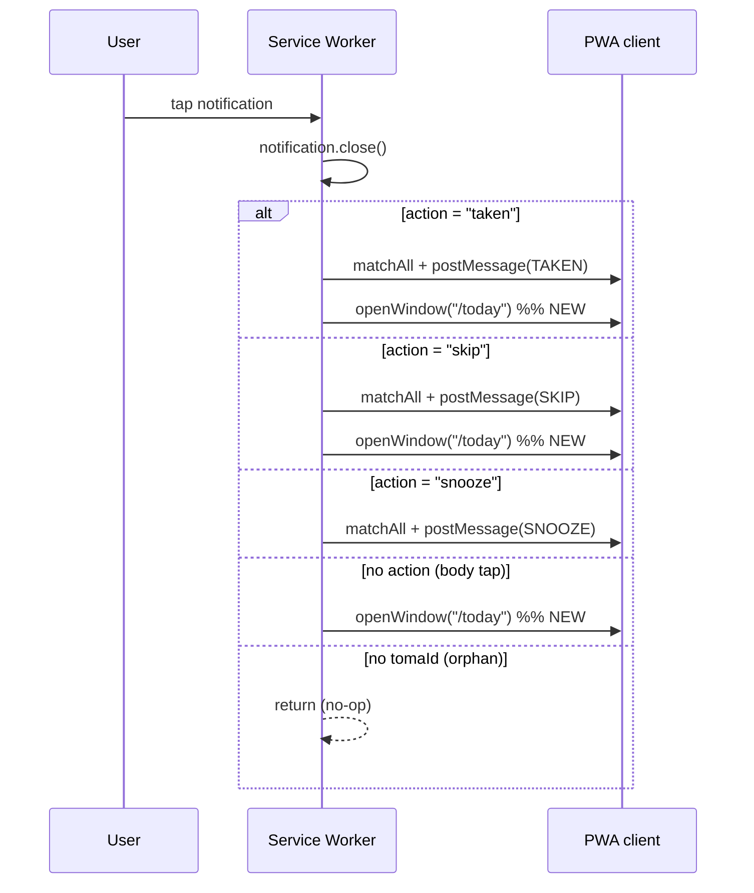

# Design: web-push-ux-fixes

## Technical Approach

Four surgical fixes that align `src/sw.ts` and `src/features/notifications/DeviceList.tsx` with the spec scenarios already in `openspec/specs/reminder/spec.md`. No new files, no new abstractions, no new dependencies. Total surface: ~25 changed lines across 2 files, plus 2 new test cases in an existing test file.

## Architecture Decisions

| Decision | Chosen (rationale) |
|---|---|
| SW navigation target | Hard-code `/today` — spec uses it literally; local `showTomaNotification` doesn't set `data`, so the fallback would be `/today` anyway |
| Body-tap branch placement | Split guards: `!action` → nav; `!tomaId` → return — keeps the orphan no-op explicit |
| Revoke order | Local first, try/catch, ALWAYS run server — spec "handles missing local subscription gracefully" requires it |
| Endpoint match before `unsubscribeFromPush` | Inline `localSub.endpoint === targetEndpoint` check — otherwise revoking another device's row from this browser unsubscribes the wrong local sub |

## Per-Gap Design

### Gap 1 (A12) — "Taken" action → navigate to `/today`

- **Where**: `src/sw.ts:165-168`, `case 'taken':` branch.
- **What**: One new line after `message.takenAt = ...`:
  `event.waitUntil(self.clients.openWindow('/today'));`
- **Why**: Spec scenario "User taps 'Taken' → status updated AND client navigates to `/today`" (reminder/spec.md:206-212). See dispatch table + mermaid.

### Gap 2 (A14) — "Skip" action → navigate to `/today`

- **Where**: `src/sw.ts:173-176`, `case 'skip':` branch.
- **What**: One new line after `message.reason = ...`:
  `event.waitUntil(self.clients.openWindow('/today'));`
- **Why**: Spec scenario "User taps 'Skip' → status updated AND client navigates to `/today`" (reminder/spec.md:221-227).

### Gap 3 (A15) — Body tap → navigate to `/today`

- **Where**: `src/sw.ts:154-182`, rewrite the `notificationclick` guard.
- **What**: Replace the combined `if (!tomaId || !action) return;` with two split guards:

  ```ts
  const action = event.action;

  // A15: body tap (no action button) → open the app
  if (!action) {
    event.waitUntil(self.clients.openWindow('/today'));
    return;
  }

  if (!tomaId) return;   // orphan notification (no tag), still a safe no-op
  ```

- **Why**: Spec "User taps notification body → app opens to `/today`" (reminder/spec.md:229-233). Current combined guard drops body taps silently.



### Gap 4 (F-02) — Revoke flow tears down local `PushSubscription`

- **Where**: `src/features/notifications/DeviceList.tsx:78-83`, `handleConfirmRevoke`. Read `endpoint` from the `subscriptions` array (line 38).
- **What**: Best-effort local unsubscribe BEFORE the server mutation; import `unsubscribeFromPush` from `./pushSubscription` (line 8 already imports `parseDeviceName` from it):

  ```ts
  const handleConfirmRevoke = async () => {
    if (!confirm.subscriptionId) return;

    const targetEndpoint = subscriptions?.find(
      (s) => s.id === confirm.subscriptionId,
    )?.endpoint;

    if (targetEndpoint && 'serviceWorker' in navigator) {
      try {
        const registration = await navigator.serviceWorker.ready;
        const localSub = await registration.pushManager.getSubscription();
        if (localSub && localSub.endpoint === targetEndpoint) {
          await unsubscribeFromPush(registration, targetEndpoint);
        }
      } catch (err) {
        console.warn('[DeviceList] local unsubscribe failed:', err);
      }
    }

    await revokeMutation.mutateAsync(confirm.subscriptionId);
    setConfirm({ isOpen: false, subscriptionId: null, deviceName: null });
  };
  ```

- **Why**: Spec "User revokes a device → server row deactivated AND local subscription terminated" (reminder/spec.md:98-106) + "handles missing local subscription gracefully" (reminder/spec.md:108-113). The endpoint-match check protects the cross-device revoke case.

## SW `notificationclick` Dispatch Table

| Trigger | tomaId | action | BEFORE | AFTER |
|---|---|---|---|---|
| Body tap | yes | `''` | early-return no-op | `openWindow('/today')` |
| Body tap | no | `''` | early-return no-op | `openWindow('/today')` |
| "Taken" tap | yes | `'taken'` | postMessage only | + `openWindow('/today')` |
| "Snooze" tap | yes | `'snooze'` | postMessage only | unchanged (spec doesn't require nav) |
| "Skip" tap | yes | `'skip'` | postMessage only | + `openWindow('/today')` |
| Orphan | no | any | early-return no-op | unchanged |

## Test Plan Implications

- `swPushHandler.test.ts` (pure fns): no change. `decidePushAction` still returns `null` for empty tomaId / empty action; body-tap navigation is in the SW glue (`sw.ts`), not the pure fn.
- `DeviceList.test.tsx`: add 2 tests in the existing `describe`:
  1. `"calls unsubscribeFromPush when local subscription matches the revoked row's endpoint"` — mock `pushManager.getSubscription()` to return a sub whose `.endpoint` equals `mockSubscriptions[0].endpoint`; assert the mocked `unsubscribeFromPush` was called.
  2. `"proceeds with server revoke when local subscription is missing"` — `getSubscription()` returns `null`; assert `revokeMutation.mutateAsync('sub-1')` was still called.
- F-04 (SW glue / Edge Function unit tests) is out of scope per the proposal.

## Rollback

Each change is 1-10 lines in one file. Revert the commit on `src/sw.ts` and/or `src/features/notifications/DeviceList.tsx`. No data migration, no schema change. The 186/186 vitest suite reverts to its pre-change state.

## Open Questions

None. Spec is unambiguous; verify-report F-01/F-02 map 1:1 to the four scenarios.
